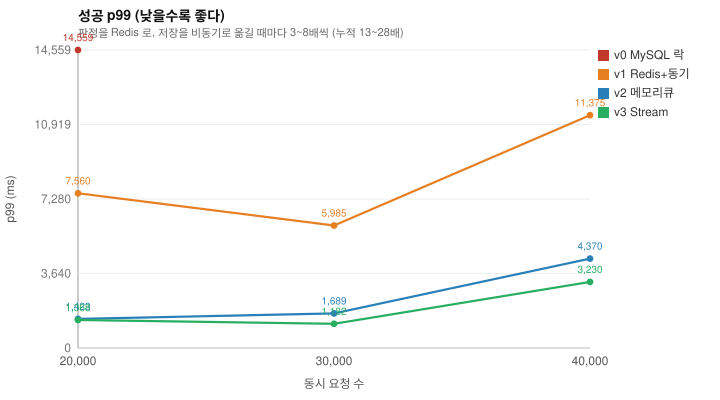
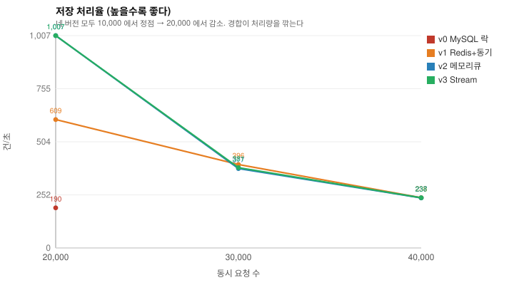
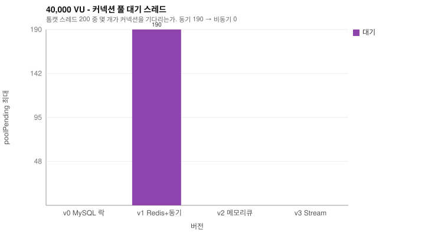
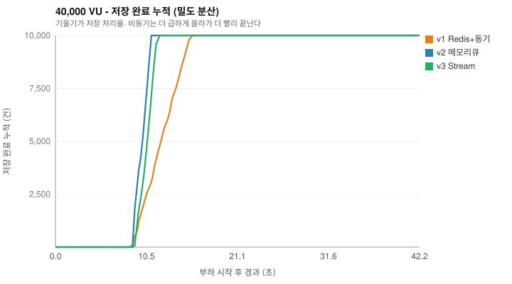
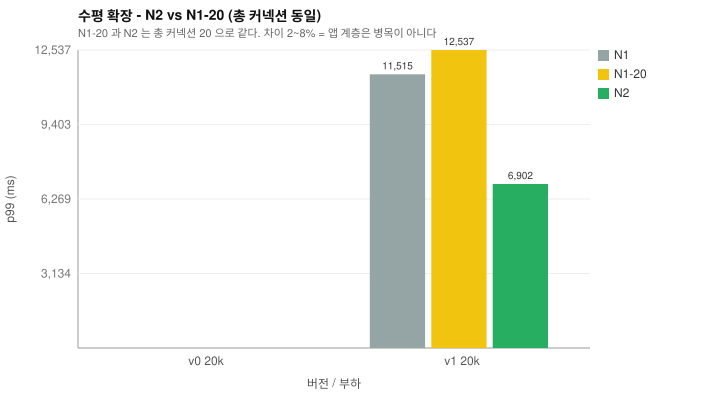

# 측정 결과 표 & 그래프

## 표 1. 성공 p99 (ms) - TTFB

| 동시 요청 | v0 MySQL 락 | v1 Redis+동기 | v2 메모리큐 | v3 Stream |
|---|---|---|---|---|
| 20,000 | 14,559 | 7,560 | 1,423 | 1,368 |
| 30,000 | - | 5,985 | 1,689 | 1,182 |
| 40,000 | - | 11,375 | 4,370 | 3,230 |

> 판정을 Redis 로 옮기고(v0→v1) 저장을 비동기로 빼면(v1→v2) 누적 13~28배다.
> v0 의 20,000 수치는 절반이 타임아웃된 뒤 남은 값이라 실제로는 더 나쁘다.

## 표 2. 저장 처리율 (건/초)

| 동시 요청 | v0 MySQL 락 | v1 Redis+동기 | v2 메모리큐 | v3 Stream |
|---|---|---|---|---|
| 20,000 | 190 | 609 | 1,007 | 1,007 |
| 30,000 | - | 396 | 377 | 381 |
| 40,000 | - | 238 | 237 | 238 |

> 네 버전 모두 10,000 에서 정점을 찍고 20,000 에서 떨어진다.
> 경합이 심해지면 처리량이 오히려 줄어든다.

## 표 3. 정확성 - 초과 발급 (게이트)

| 동시 요청 | 버전 | dbIssued | 재고 | 판정 |
|---|---|---|---|---|
| 20,000 | v0 MySQL 락 | 4,462 | 10,000 | ✅ |
| 20,000 | v1 Redis+동기 | 10,037 | 10,000 | ❌ 초과 |
| 20,000 | v2 메모리큐 | 10,000 | 10,000 | ✅ |
| 20,000 | v3 Stream | 10,000 | 10,000 | ✅ |
| 30,000 | v1 Redis+동기 | 10,000 | 10,000 | ✅ |
| 30,000 | v2 메모리큐 | 10,000 | 10,000 | ✅ |
| 30,000 | v3 Stream | 10,000 | 10,000 | ✅ |
| 40,000 | v1 Redis+동기 | 10,000 | 10,000 | ✅ |
| 40,000 | v2 메모리큐 | 10,000 | 10,000 | ✅ |
| 40,000 | v3 Stream | 10,000 | 10,000 | ✅ |

> 빠른데 틀리면 의미가 없다. 이 표가 통과하지 못하면 성능 수치는 무효다.

## 표 4. 40,000 VU 상세

| 버전 | 에러율 | p99(ms) | 저장/s | 적체 | poolPending | GC | heap(MB) |
|---|---|---|---|---|---|---|---|
| v1 Redis+동기 | 50% | 11,375 | 238 | - | 190 | 0.62% | 1,403 |
| v2 메모리큐 | 50% | 4,370 | 237 | 568 | 0 | 0.54% | 1,446 |
| v3 Stream | 50% | 3,230 | 238 | 3,542 | 0 | 0.54% | 1,426 |

> `poolPending` 190 → 0 이 병목 위치의 직접 증거다.
> v0 의 에러율은 k6 15초 타임아웃이다 - 거절 응답조차 돌아오지 않았다.

## 표 6. 수평 확장 (로컬, 앱 프로세스 2개)

| 동시 요청 | 버전 | N1 (1대·pool10) | N1-20 (1대·pool20) | N2 (2대·각10) |
|---|---|---|---|---|
| 20,000 | v0 MySQL 락 | - | - | - |
| 20,000 | v1 Redis+동기 | 11,515 (에러 6%) | 12,537 (에러 24%) | 6,902 |

> **N2 vs N1-20** - 총 커넥션 20 으로 같고 앱 대수만 다르다.
> 차이가 2~8% 로 노이즈 수준이면 **앱 계층은 병목이 아니다.**

## 그래프

