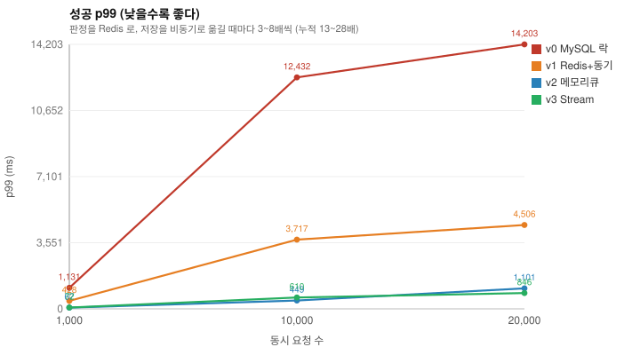
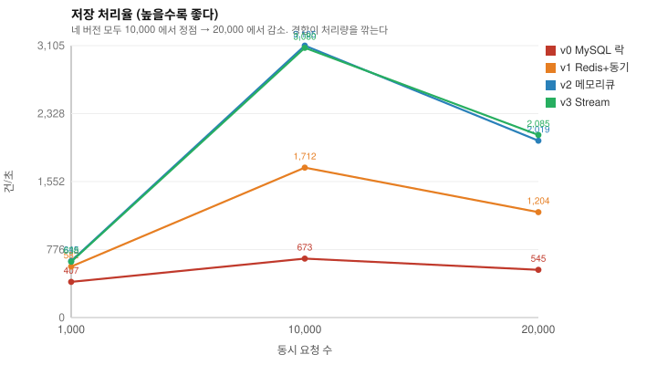
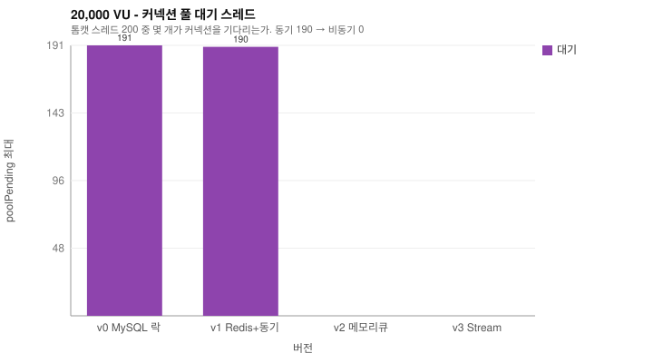
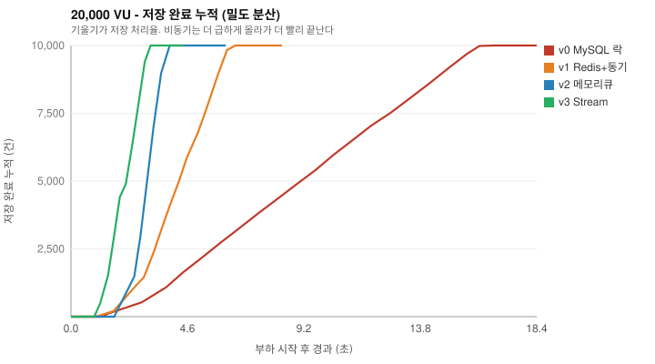
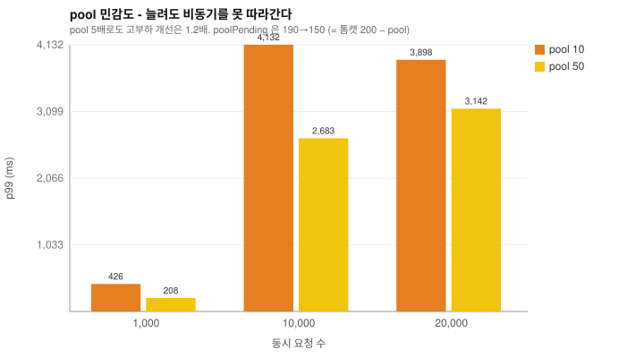
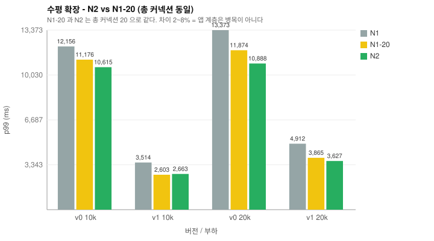

# 측정 결과 표 & 그래프

> 이 파일은 `scripts/parse.py` 생성물이다. 손으로 고치면 다음 실행에 덮인다. raw: `results/`

## 표 1. 성공 p99 (ms) - TTFB

| 동시 요청 | v0 MySQL 락 | v1 Redis+동기 | v2 메모리큐 | v3 Stream |
|---|---|---|---|---|
| 1,000 | 1,131 | 428 | 67 | 72 |
| 10,000 | 12,432 | 3,717 | 449 | 610 |
| 20,000 | 14,203 | 4,506 | 1,101 | 846 |

> v0 대비 최적 버전의 응답 개선: 1,000 에서 17.0배, 10,000 에서 27.7배, 20,000 에서 16.8배.
> 타임아웃이 섞인 회차의 p99 는 살아남은 요청만의 값이라 실제로는 더 나쁘다.

## 표 2. 저장 처리율 (건/초)

| 동시 요청 | v0 MySQL 락 | v1 Redis+동기 | v2 메모리큐 | v3 Stream |
|---|---|---|---|---|
| 1,000 | 407 | 582 | 645 | 638 |
| 10,000 | 673 | 1,712 | 3,105 | 3,080 |
| 20,000 | 545 | 1,204 | 2,019 | 2,085 |

> 네 버전 모두 10,000 에서 정점을 찍고 그 위에서 떨어진다. 경합이 심해지면 처리량이 오히려 줄어든다.

## 표 3. 정확성 - 초과 발급 (게이트)

| 동시 요청 | 버전 | dbIssued | 재고 | 판정 |
|---|---|---|---|---|
| 1,000 | v0 MySQL 락 | 1,000 | 10,000 | ✅ |
| 1,000 | v1 Redis+동기 | 1,000 | 10,000 | ✅ |
| 1,000 | v2 메모리큐 | 1,000 | 10,000 | ✅ |
| 1,000 | v3 Stream | 1,000 | 10,000 | ✅ |
| 10,000 | v0 MySQL 락 | 10,000 | 10,000 | ✅ |
| 10,000 | v1 Redis+동기 | 10,000 | 10,000 | ✅ |
| 10,000 | v2 메모리큐 | 10,000 | 10,000 | ✅ |
| 10,000 | v3 Stream | 10,000 | 10,000 | ✅ |
| 20,000 | v0 MySQL 락 | 10,000 | 10,000 | ✅ |
| 20,000 | v1 Redis+동기 | 10,000 | 10,000 | ✅ |
| 20,000 | v2 메모리큐 | 10,000 | 10,000 | ✅ |
| 20,000 | v3 Stream | 10,000 | 10,000 | ✅ |

> 빠른데 틀리면 의미가 없다. 이 표가 통과하지 못하면 성능 수치는 무효다.

## 표 4. 20,000 VU 상세

| 버전 | 에러율 | p99(ms) | 저장/s | 적체 | poolPending | GC | heap(MB) |
|---|---|---|---|---|---|---|---|
| v0 MySQL 락 | 50% | 14,203 | 545 | - | 191 | 1.05% | 891 |
| v1 Redis+동기 | 0% | 4,506 | 1,204 | - | 190 | 3.04% | 963 |
| v2 메모리큐 | 0% | 1,101 | 2,019 | 4,932 | 0 | 8.40% | 1,148 |
| v3 Stream | 0% | 846 | 2,085 | 4,499 | 0 | 7.63% | 1,162 |

> 동기 저장(v0·v1)만 `poolPending` 이 쌓인다. 병목 위치의 직접 증거다.
> 에러는 k6 15초 타임아웃이다 - 그 요청들은 응답을 받지 못했다.

## 표 5. pool 민감도 (v1, pool 10 vs 50)

| 동시 요청 | pool 10 | pool 50 | 개선 |
|---|---|---|---|
| 1,000 | 426 | 208 | 2.04배 |
| 10,000 | 4,132 | 2,683 | 1.54배 |
| 20,000 | 3,898 | 3,142 | 1.24배 |

`poolPending`: pool 10 → 190, pool 50 → 150  (= 톰캣 스레드 200 − pool 크기)

> 기준선: 같은 세션의 v2 = 1,035ms. pool 을 5배 늘려도 비동기의 3배 뒤에 머문다.

## 표 6. 수평 확장 (앱 프로세스 2개)

| 동시 요청 | 버전 | N1 (1대·pool10) | N1-20 (1대·pool20) | N2 (2대·각10) |
|---|---|---|---|---|
| 10,000 | v0 MySQL 락 | 12,156 | 11,176 | 10,615 |
| 10,000 | v1 Redis+동기 | 3,514 | 2,603 | 2,663 |
| 20,000 | v0 MySQL 락 | 13,373 (에러 52%) | 11,874 (에러 11%) | 10,888 |
| 20,000 | v1 Redis+동기 | 4,912 | 3,865 | 3,627 |

> **N2 vs N1-20** - 총 커넥션 20 으로 같고 앱 대수만 다르다.
> 차이가 최대 8% 로 회차 편차 수준이다 - **앱 계층은 병목이 아니다.** 단 앱 2대가 같은 CPU 를 나눠 쓴 환경이면 확장 효과가 가려질 수 있다.

## 표 7. 브로커 킬 - Redis AOF 모드별 유실

| AOF | 약속한 발급 | 저장됨 | 유실 | 판정 |
|---|---|---|---|---|
| `off` | 10,000 | 0 | **10,000** | ❌ 전량 유실 |
| `everysec` | 10,000 | 10,000 | 0 | ✅ 유실 0 |
| `always` | 10,000 | 10,000 | 0 | ✅ 유실 0 |

> `everysec` 과 `always` 는 이 실험으로 구분되지 않는다. `docker kill` 은
> 컨테이너 프로세스만 죽이고 **호스트 페이지 캐시는 남는다.**

## 표 8. 내구성의 가격 (v3 p99, 3회 중앙값)

| AOF | p99 (ms) |
|---|---|
| `off` | 1,502 |
| `everysec` | 1,265 |
| `always` | 1,254 |

> `always` 가 가장 빠르게 나오기도 했다. **노이즈에 묻혀 판별 불가.**

## 그래프

